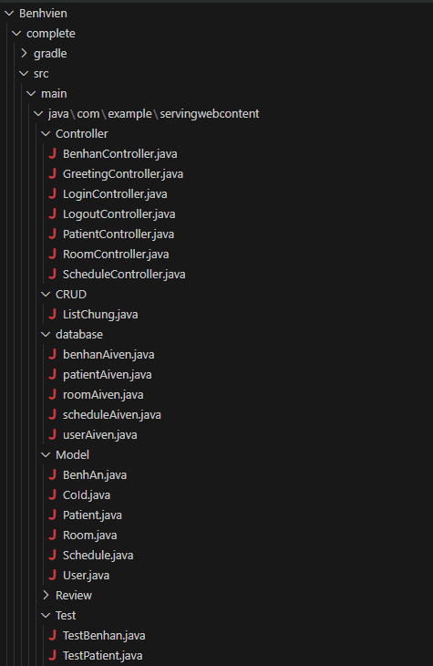
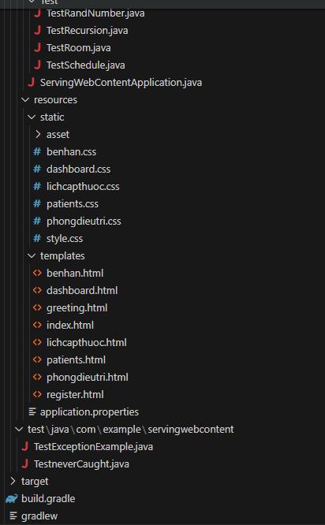
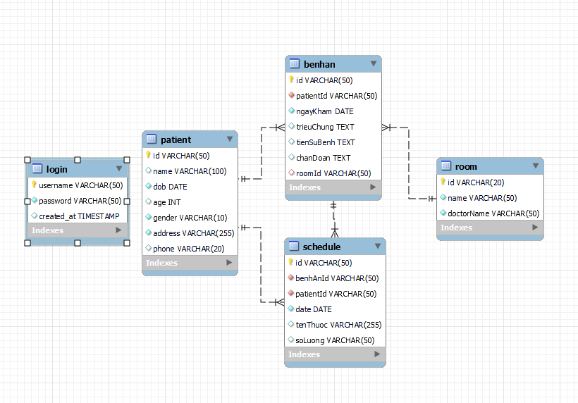
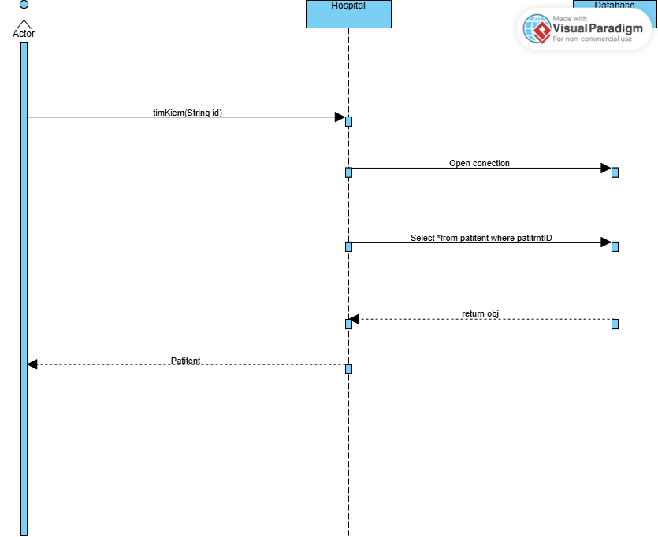
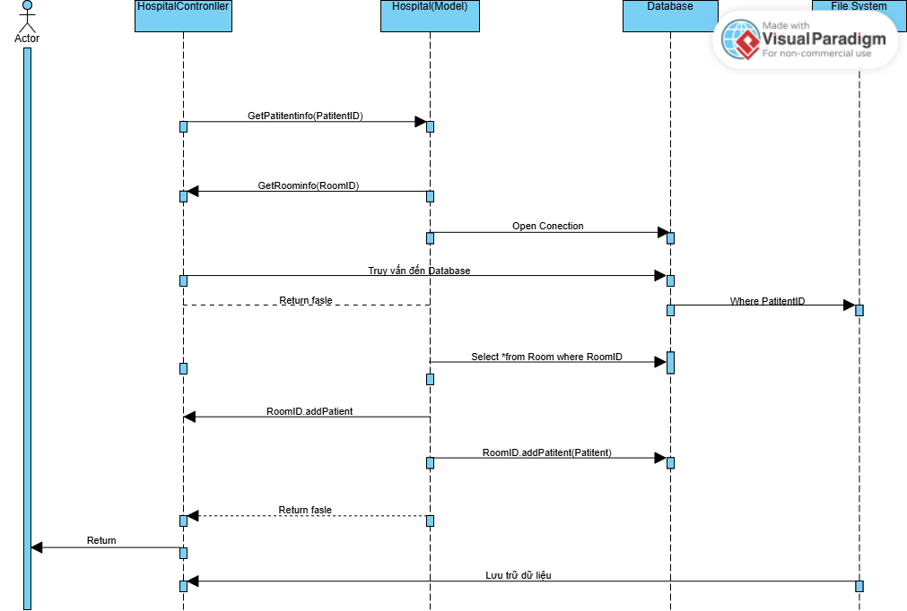

# HỆ THỐNG QUẢN LÝ KHÁM CHỮA BỆNH

## GIỚI THIỆU DỰ ÁN
Đây là dự án quản lý khám chữa bệnh
## Các thành viên trong nhóm
- **Nguyễn Mạnh Quyền-23010198**:Phát triển phần mềm

## I. Giới thiệu Project

### 🏥 Giới thiệu Dự án Quản Lý Bệnh Viện
Đây là một ứng dụng web được xây dựng bằng Java Spring Boot, nhằm hỗ trợ công tác quản lý thông tin bệnh nhân và hồ sơ y tế tại các cơ sở y tế.
Ứng dụng hướng tới việc tự động hóa, đơn giản hóa và số hóa quy trình quản lý bệnh viện.

### 🔧 Các chức năng chính

**📁 Quản lý thông tin bệnh nhân**

Thêm, sửa, xóa thông tin bệnh nhân.

Tìm kiếm linh hoạt bệnh nhân theo nhiều tiêu chí.

Liệt kê toàn bộ danh sách bệnh nhân hiện có.

**Quản lý bệnh án**

Tạo mới, chỉnh sửa, xóa bệnh án của từng bệnh nhân.

Tìm kiếm bệnh án theo mã bệnh án hoặc bệnh nhân.

Hiển thị thông tin phòng khám tương ứng cho mỗi hồ sơ bệnh án.

**Quản lý lịch cấp thuốc**

Ghi nhận lịch cấp thuốc theo từng bệnh nhân.

Cập nhật, tìm kiếm hoặc xóa lịch cấp thuốc đã lưu.

Theo dõi ngày cấp thuốc và loại thuốc được cấp trong từng đợt khám.

**Công nghệ sử dụng**

Java 17, Spring Boot

Thymeleaf (Giao diện web)

MySQL / Aiven (Cơ sở dữ liệu)

HTML/CSS, Bootstrap (Thiết kế giao diện người dùng)

## II. Thiết kế các đối tượng
#### Lớp Patient (Bệnh nhân)

**1. Giới thiệu:**
Lớp Patient đại diện cho thông tin bệnh nhân trong hệ thống quản lý bệnh viện. Mỗi đối tượng bệnh nhân lưu trữ đầy đủ thông tin cá nhân như mã bệnh nhân, họ tên, ngày sinh, tuổi, giới tính, địa chỉ và số điện thoại. Lớp này là trung tâm để liên kết với các thông tin bệnh án, lịch sử điều trị và cấp thuốc.

**2. Thuộc tính:**

| Tên thuộc tính | Kiểu dữ liệu | Mô tả                          |
|----------------|--------------|--------------------------------|
| `id`           | String       | Mã định danh bệnh nhân         |
| `name`         | String       | Họ và tên                      |
| `dob`          | Calendar     | Ngày sinh                      |
| `age`          | int          | Tuổi (tính toán từ ngày sinh)  |
| `gender`       | String       | Giới tính                      |
| `address`      | String       | Địa chỉ cư trú                 |
| `phone`        | String       | Số điện thoại liên lạc         |


**3. Phương thức:**


| Tên phương thức   | Mô tả                                      |
|-------------------|---------------------------------------------|
| `get` / `set`     | Truy xuất và cập nhật thuộc tính            |
| `calculateAge()`  | Tính tuổi từ ngày sinh                      |
| `toString()`      | Xuất thông tin bệnh nhân theo định dạng sẵn |


#### Lớp BenhAn (Bệnh án)

**1. Giới thiệu:**

Lớp BenhAn mô tả chi tiết quá trình khám và điều trị của bệnh nhân. Mỗi bệnh án bao gồm ngày khám, triệu chứng, tiền sử bệnh, chẩn đoán và liên kết đến phòng điều trị cụ thể.

**2. Thuộc tính:**

| Tên thuộc tính | Kiểu dữ liệu | Mô tả                         |
|----------------|--------------|-------------------------------|
| `id`           | String       | Mã bệnh án                    |
| `patientId`    | String       | Mã bệnh nhân liên kết         |
| `ngayKham`     | Calendar     | Ngày khám bệnh                |
| `trieuChung`   | String       | Triệu chứng lâm sàng          |
| `tienSuBenh`   | String       | Thông tin tiền sử bệnh        |
| `chanDoan`     | String       | Kết quả chẩn đoán             |
| `roomId`       | String       | Mã phòng điều trị liên quan   |

**3. Phương thức:**

| Tên phương thức | Mô tả                              |
|------------------|-------------------------------------|
| `get` / `set`     | Truy xuất và cập nhật dữ liệu      |
| `toString()`      | Trả về thông tin định dạng sẵn     |

#### Lớp Schedule (Lịch cấp thuốc)

**1. Giới thiệu:**

Lớp Schedule lưu trữ lịch cấp phát thuốc cho bệnh nhân theo từng bệnh án cụ thể, ghi lại thông tin thuốc, số lượng và thời gian cấp.

**2. Thuộc tính:**

| Tên thuộc tính | Kiểu dữ liệu | Mô tả                    |
|----------------|--------------|---------------------------|
| `id`           | String       | Mã lịch cấp thuốc         |
| `benhanId`     | String       | Mã bệnh án liên quan      |
| `patientId`    | String       | Mã bệnh nhân              |
| `date`         | Calendar     | Ngày cấp thuốc            |
| `tenthuoc`     | String       | Tên thuốc                 |
| `soluong`      | String       | Số lượng thuốc            |

**3. Phương thức:**

| Tên phương thức | Mô tả                              |
|------------------|-------------------------------------|
| `get` / `set`     | Truy xuất và cập nhật dữ liệu      |
| `toString()`      | Trả về thông tin định dạng sẵn     |

#### Lớp Room (Phòng điều trị)

**1. Giới thiệu:**

Lớp Room đại diện cho các phòng điều trị trong bệnh viện. Mỗi phòng có thông tin về mã phòng, tên phòng, bác sĩ phụ trách.

**2. Thuộc tính:**

| Tên thuộc tính | Kiểu dữ liệu | Mô tả                     |
|----------------|--------------|----------------------------|
| `id`           | String       | Mã phòng                   |
| `name`         | String       | Tên phòng                  |
| `doctorName`   | String       | Tên bác sĩ phụ trách       |

**3. Phương thức:**

| Tên phương thức | Mô tả                                  |
|------------------|-----------------------------------------|
| `get` / `set`     | Truy cập và cập nhật thông tin         |
| `toString()`      | In thông tin phòng theo định dạng      |

#### Lớp User (Người dùng)

**1. Giới thiệu:**

Lớp User đại diện cho tài khoản người dùng trong hệ thống. Mỗi user có username và password để đăng nhập.

**2. Thuộc tính:**

| Tên thuộc tính | Kiểu dữ liệu | Mô tả                |
|----------------|--------------|-----------------------|
| `username`     | String       | Tên đăng nhập         |
| `password`     | String       | Mật khẩu đăng nhập    |

**3. Phương thức:**

| Tên phương thức | Mô tả                                        |
|------------------|-----------------------------------------------|
| `get` / `set`     | Truy xuất và cập nhật thông tin người dùng   |

#### Interface CoId

**1. Giới thiệu:**

Interface CoId dùng để chuẩn hóa các lớp có mã định danh (id). Nhờ đó, hệ thống có thể xử lý thống nhất các đối tượng dựa trên id.

**2. Phương thức:**

| Phương thức     | Mô tả                 |
|-----------------|------------------------|
| `getId()`       | Trả về mã định danh    |
| `setId(String)` | Gán mã định danh       |

#### Các Phương Thức Hoạt Động Chính Của Ứng Dụng

| STT | Tên Controller          | Chức năng chính                            | Đối tượng liên quan                  | Ghi chú                   |
|-----|-------------------------|---------------------------------------------|--------------------------------------|---------------------------|
| 1   | `BenhanController`      | Quản lý bệnh án                             | BenhAn, Patient, Room                | Hoạt động trung tâm       |
| 2   | `PatientController`     | Quản lý thông tin bệnh nhân                 | Patient                              | Đối tượng chính           |
| 3   | `ScheduleController`    | Quản lý lịch khám                           | Schedule, BenhAn, Patient            | Có liên kết nhiều bảng    |
| 4   | `RoomController`        | Quản lý phòng bệnh                          | Room                                 | Bổ trợ cho chức năng chính|
| 5   | `LoginController`       | Đăng nhập hệ thống                          | User                                 | Hỗ trợ hoạt động          |


#### Kết luận
Việc thiết kế hệ thống lớp như trên đáp ứng yêu cầu về phân tầng logic, dễ bảo trì, mở rộng và tích hợp giao diện. Các đối tượng được liên kết rõ ràng, dữ liệu được tổ chức có định danh (id) giúp dễ truy xuất và lưu trữ, hỗ trợ tốt cho các chức năng của hệ thống quản lý bệnh viện.

## III. Công nghệ sử dụng
##### Frontend:Giao diện người dùng được xây dựng thông qua engine **Thymeleaf**, tích hợp trực tiếp với **Spring Boot**. Việc này giúp kết nối mượt mà giữa giao diện và logic xử lý, đồng thời tạo điều kiện thuận lợi để mở rộng giao diện về sau.

##### Backend:Phần xử lý nghiệp vụ sử dụng **Spring Boot** với kiến trúc **MVC (Model - View - Controller)**. Cách tiếp cận này giúp tổ chức mã nguồn rõ ràng, dễ bảo trì và tách biệt các thành phần logic.

##### Cơ sở dữ liệu:Hệ thống sử dụng **MySQL** để lưu trữ dữ liệu như tài khoản, bệnh nhân, bệnh án, lịch sử điều trị,... Cơ sở dữ liệu được thiết kế chuẩn hóa để đảm bảo tính toàn vẹn và hiệu quả truy xuất dữ liệu.

##### Công cụ build:Dự án sử dụng **Maven** để quản lý thư viện, phụ thuộc và biên dịch mã nguồn. Maven giúp tự động hóa quá trình build, test và đóng gói ứng dụng một cách đồng bộ và hiệu quả.


## IV. Cấu trúc thư mục





## V.Mô hình và chức năng
Hệ thống được xây dựng theo mô hình **MVC (Model - View - Controller)** giúp phân tách rõ ràng giữa:

- **Model:** Chứa các lớp biểu diễn dữ liệu như Bệnh nhân, Bệnh án, Phòng điều trị...
- **database** Quản lý dữ liệu.
- **Controller:** Xử lý logic, tiếp nhận yêu cầu và điều hướng dữ liệu giữa Model và View.

Mô hình này giúp tăng tính tái sử dụng mã nguồn, dễ bảo trì và thuận tiện mở rộng chức năng.

### Chức năng chính của hệ thống

- **Quản lý tài khoản người dùng:**  
  Người dùng có thể đăng ký, đăng nhập hệ thống.

- **Quản lý bệnh nhân:**  
  Thêm mới, cập nhật, xóa và tìm kiếm bất kì thông tin nào có.

- **Quản lý bệnh án:**  
  Lưu trữ thông tin khám, chẩn đoán và điều trị của từng bệnh nhân. Cho phép thêm, sửa, tìm kiếm và quản lý hồ sơ bệnh án.

- **Quản lý phòng khám:**  
  Ghi nhận thông tin các phòng bệnh, bác sĩ khám.

- **Quản lý lịch cấp thuốc:**  
  Theo dõi và quản lý lịch sử cấp phát thuốc cho bệnh nhân.

- **Giao diện người dùng (UI):**  
  Đơn giản, dễ sử dụng, được triển khai bằng Spring Boot + Thymeleaf.

  
## VI. Sơ đồ khối
### 1.UML Class Diagram


### 2.UML Sequence Diagram


#### 1.Findpatitent


#### 2.FindBenhan


#### 3.Schedule


#### 4.Room


## VII. Thông tin trong mySQL
### 🏥 Hospital Database Schema

Tệp này mô tả các lệnh SQL được sử dụng để tạo cơ sở dữ liệu **bệnh viện**, bao gồm tất cả các bảng cần thiết như bảng đăng nhập, bệnh nhân, phòng, hồ sơ bệnh án và lịch trình.

#### 📌 1.Create Database

```sql
CREATE DATABASE hospital;
USE hospital;
```

#### 🔐 2.Table: `login`

```sql
CREATE TABLE IF NOT EXISTS login (
    username VARCHAR(50) PRIMARY KEY,
    password VARCHAR(50) NOT NULL,
    created_at TIMESTAMP DEFAULT CURRENT_TIMESTAMP
);
```
**Tài khoản quản trị mặc định:**

```sql
INSERT IGNORE INTO login (username, password) VALUES ('admin', '123456');
```

#### 🧍 3.Table: `patient`
Lưu trữ thông tin cá nhân về bệnh nhân.
```sql
CREATE TABLE patient (
    id VARCHAR(50) PRIMARY KEY,
    name VARCHAR(100),
    dob DATE NOT NULL,
    age INT,
    gender VARCHAR(10) NOT NULL,
    address VARCHAR(255) NOT NULL,
    phone VARCHAR(20)
);
```
**Thông tin mặc định:có thể sửa**
```sql
INSERT INTO patient (id, name, dob, age, gender, address, phone) VALUES
('P001', 'Nguyễn Văn Thành', '2005-02-19', 20, 'Nam', 'Hà Nội', '0987654321'),
('P002', 'Trần Thị Bình', '2000-11-2', 24, 'Nữ', 'Da Nang', '0987654321');
```

#### 🏨 4.Table: `room`
Lưu trữ thông tin cá nhân về phòng khám.
```sql
CREATE TABLE room (
    id VARCHAR(20) PRIMARY KEY,
    room_name VARCHAR(50) NOT NULL,
    floor VARCHAR(50) NOT NULL,
    room_type VARCHAR(50) NOT NULL,
    capacity VARCHAR(50) NOT NULL,
    doctor_name VARCHAR(50) NOT NULL
);
```
**Thông tin mặc định:có thể sửa**
```sql
INSERT INTO room (id, name, doctorName) VALUES
('R001', 'Phòng Nội trú A', 'BS. Le Minh'),
('R002', 'Phòng Cấp cứu', 'BS. Nguyen Lan');
```

#### 📋 5.Table: `benhAn` (Medical Record)
Lưu trữ hồ sơ bệnh án của bệnh nhân.
```sql
CREATE TABLE benhAn (
    id VARCHAR(50) PRIMARY KEY,
    patientId VARCHAR(50) NOT NULL,
    ngayKham DATE NOT NULL,
    trieuChung TEXT,
    tienSuBenh TEXT,
    chanDoan TEXT,
    roomId VARCHAR(50),
    FOREIGN KEY (patientId) REFERENCES patient(id),
    FOREIGN KEY (roomId) REFERENCES room(id)
);
```
**Thông tin mặc định:có thể sửa**
```sql
INSERT INTO benhAn (id, patientId, ngayKham, trieuChung, tienSuBenh, chanDoan, roomId) VALUES
('BA001', 'P001', '2025-06-01', 'Sốt, ho', 'Tiền sử hen suyễn', 'Viêm phổi', 'R001'),
('BA002', 'P002', '2025-06-10', 'Đau bụng', 'Không rõ', 'Viêm ruột', 'R002');
```
#### 💊 6.Table: `schedule` (Medication Schedule)
Quản lý lịch trình dùng thuốc.
```sql
CREATE TABLE schedule (
    id VARCHAR(50) PRIMARY KEY,
    benhAnId VARCHAR(50) NOT NULL,
    patientId VARCHAR(50) NOT NULL,
    date DATE NOT NULL,
    tenThuoc VARCHAR(255),
    soLuong VARCHAR(50),
    FOREIGN KEY (benhAnId) REFERENCES benhAn(id),
    FOREIGN KEY (patientId) REFERENCES patient(id)
);
```
**Thông tin mặc định:có thể sửa**
```sql
INSERT INTO schedule (id, benhAnId, patientId, date, tenThuoc, soLuong) VALUES
('BT001', 'BA001', 'P001', '2025-06-02', 'Paracetamol', '10 viên'),
('BT002', 'BA002', 'P002', '2025-06-11', 'Smecta', '5 vien');
```
##### Ghi chú
- Trong Schedule ở mysql sẽ hiện patientId còn trong giao diện sẽ hiện tên benhnhan cho dễ nhân dạng hơn,tránh trùng quá nhiều id.
- Tất cả các mối quan hệ khóa chính và khóa ngoại đều được xác định rõ ràng.
- Bảng `room` sử dụng tên cột riêng biệt để tránh trùng lặp.
- Sử dụng `INSERT IGNORE` để chèn dữ liệu mặc định an toàn.


## VIII. Giao diện các chức năng của Project

### Giao diện trang đăng nhập
<p align="center">
  
</p>

### Giao diện trang đăng ký tài khoản
<p align="center">
  
</p>

### Giao diện màn hình chính
<p align="center">
  
</p>

### Giao diện trang quản lý bệnh nhân
<p align="center">
  
</p>

### Giao diện trang quản lý phòng điều trị
<p align="center">
  
</p>

### Giao diện trang quản lý bệnh án
<p align="center">
  
</p>

### Giao diện trang quản lý lịch cấp thuốc
<p align="center">
  
</p>

## LINK REPO:
https://github.com/ngthanhs1/Group2_OOP_N02_term3_2025/tree/main

## LINK DEMO SẢN PHẨM
https://youtu.be/MRYtEZ2JOJU?feature=shared

## GitHub Pages Dự Án
https://ngthanhs1.github.io/Group2_OOP_N02_term3_2025

## Cách Cài Đặt
1.Clone repository từ GitHub:
```python
git clone -b FinaltermCode ht
```

